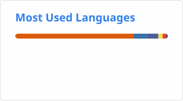

<!---
chandana-galgali/chandana-galgali is a ✨ special ✨ repository because its `README.md` (this file) appears on your GitHub profile.
You can click the Preview link to take a look at your changes.
--->

  

<h1 align="center">
  Let's Connect and have a Chat!💬
</h1>

---

<h2> 👩‍💻 &nbsp;About Me</h2>

Hi there 👋 I just genuinely love engineering and building cool things! 🚀

* 👂 **My name is**: Chandana Ramesh Galgali
* 👩 **Pronouns**: She/Her | 🌍 **Located in**: Mumbai, India
* 🎓 **Education**: B.Tech in IT with Honors in AI from KJSCE (2026)
* 🎯 **Philosophy**: I believe the best developers are versatile. I love mixing domains that traditionally shouldn't mix!

💼 **My Versatile Work Experiences**:
* **Research Intern @ IIT Bombay**: Exploring JIT compilers and dynamic language optimizations
* **SDE Intern @ Barclays**: Built real-time SLA monitoring pipelines and predictive AI PoCs
* **Web App Security Intern @ Keva**: Conducted vulnerability analysis and penetration testing
* **Machine Learning Intern @ Prodigy InfoTech**: Built end-to-end predictive and CV models · 🔗 [Results](https://chandana-galgali.github.io/applied-ml-projects/)
* **Java Developer Intern @ Keva**: Java backend development with Maven · 🔗 [Live Demo](https://chandana-galgali.github.io/formula-substitution-engine/)
* **Web Development Intern @ KJSCE**: Developed interactive virtual lab for students · 🔗 [Live Demo](https://chandana-galgali.github.io/Virtual-DSA-Laboratory)

🌟 **Leadership & Open Source**: 
* **Tech Contributor @ GirlScript Summer of Code**: Contributed to open-source tech initiatives
* **General Secretary @ Team Emfinity**: Led a 30-member team and managed tech events

🔭 **My Featured Repositories**:
* [AI-Powered Multi-Pollutant Mapping for Hyperlocal Air Quality Monitoring](https://github.com/chandana-galgali/AI-Powered-Multi-Pollutant-Mapping-for-Hyperlocal-Air-Quality-Monitoring) (Climate Hackathon 2024, Winner + 1.5 Lakh Grant to implement solution on university campus) 🏆 Downscales Sentinel-5P data for 6 pollutants from ~1 km to 10 m with a hybrid regression + CNN, validated against NASA airborne NO₂ maps · [Live](https://hyperlocal-air-quality.onrender.com)
* [Text-to-AR/VR : Generating AR/VR Visualization from Textual Description of Numerical Data](https://github.com/chandana-galgali/Text-to-AR-VR-Visualizing-Numerical-Data) 🥽 LLM + custom RAG pipeline that turns text descriptions of numbers into interactive AR/VR charts in Unity, 88.89% chart-selection accuracy
* [Automated Caption Generation using Encoder-Decoder Model for Targetted Objects (Jewellery Images)](https://github.com/chandana-galgali/Automated-Caption-Generation-using-Encoder-Decoder-Model-for-Jewellery-Images) 🖼️ VGG-16 + attention GRU, 98.64% classification accuracy and CIDEr-D 0.876 on held-out data, runs in the browser · [Live](https://chandana-galgali.github.io/Automated-Caption-Generation-using-Encoder-Decoder-Model-for-Jewellery-Images/)
* [Voice-Enabled Geospatial UI](https://github.com/chandana-galgali/Voice-Enabled-Geospatial-UI) (ISRO Bharatiya Antariksh Hackathon 2024) 🗺️ On-device Whisper speech recognition with a fault-tolerant intent parser, 91.7% intent accuracy · [Live](https://voice-enabled-geospatial-ui.netlify.app/)

🧰 **More Things I've Built**:

**AI & ML**
* [ConsultLens](https://github.com/chandana-galgali/ConsultLens) (Health-a-thon 2026): multilingual workspace that turns scattered medical records into verified, source-linked patient journeys, with OCR and human-in-the-loop review 🩺 · [Live](https://consultlens.vercel.app/)
* [Applied ML Projects](https://github.com/chandana-galgali/applied-ml-projects): 5 end-to-end ML projects with held-out metrics (regression R² 0.930, 89.0% food detection, 83.2% gesture accuracy on unseen people) 📈 · [Live](https://chandana-galgali.github.io/applied-ml-projects/)
* [CineSentiment](https://github.com/chandana-galgali/Sentiment-Analysis-of-IMDb-Movie-Reviews-using-LSTM): LSTM sentiment classifier, 85.28% test accuracy, Streamlit app 🎬 · [Live](https://cine-sentiment-imdb.streamlit.app)

**Full-Stack & Web**
* [Voluntr](https://github.com/chandana-galgali/Voluntr-Django-Volunteering-Platform): Django volunteering platform with maps, QR check-in, hour tracking, certificates and organizer dashboards 🌱 · [Live](https://voluntr.onrender.com)
* [Cinna Fragrances](https://github.com/chandana-galgali/Cinna-Fragrances-Ecommerce): PERN-stack fragrance store with scent finder, transactional checkout and admin analytics 🛍️ · [Live](https://cinna-fragrances.onrender.com)
* [Virtual DSA Laboratory](https://github.com/chandana-galgali/Virtual-DSA-Laboratory): React lab simulating 18 DSA experiments step by step, used by 350+ students 🧪 · [Live](https://chandana-galgali.github.io/Virtual-DSA-Laboratory/)
* [Portfolio](https://github.com/chandana-galgali/chandana-galgali.github.io): my personal portfolio website 💻 · [Live](https://chandana-galgali.github.io/)

**Dev Tools & Packages**
* [react-ambient-light-adaptive-theme](https://github.com/chandana-galgali/react-ambient-light-adaptive-theme): npm package that themes your React app from real ambient light 📦 · [Live](https://chandana-galgali.github.io/react-ambient-light-adaptive-theme/)
* [Formula Substitution Engine](https://github.com/chandana-galgali/formula-substitution-engine): Java + Spring Boot HashMap rule engine, up to ~880× faster than a linear scan ⚗️ · [Live](https://chandana-galgali.github.io/formula-substitution-engine/)
* [AST-Query](https://github.com/chandana-galgali/AST-Query): zero-dependency CLI to search Python code by structure, not text 🔍 · [Live](https://chandana-galgali.github.io/AST-Query/)
* [PixelBatch](https://github.com/chandana-galgali/Batch-Image-Optimizer): private batch image optimizer, in the browser or as a Python CLI 🖼️ · [Live](https://chandana-galgali.github.io/Batch-Image-Optimizer/)
* [Gmail Bulk Trash Purger](https://github.com/chandana-galgali/gmail-bulk-trash-purger): Apps Script that empties huge Gmail Trash folders without timeouts 🗑️ · [Live](https://chandana-galgali.github.io/gmail-bulk-trash-purger/)

**Data & Academics**
* [AuverGrid Workload Analysis](https://github.com/chandana-galgali/Analysis-of-the-GWA-T-4-AuverGrid-Workload): characterisation of 404k real grid-computing jobs 📊 · [Live](https://chandana-galgali.github.io/Analysis-of-the-GWA-T-4-AuverGrid-Workload/)
* [KJSCE IT Reference Material](https://github.com/chandana-galgali/KJSCE-IT-Reference-Material): notes, lab code and write-ups from my B.Tech in IT (2022-2026) 📚

 

💬 **You can talk to me about**: Software systems, AI applications, System architectures, F1 constructor strategies or even One Piece lore lol! 
📫 **How to reach me**: chandana.galgali@gmail.com

--- 
  
<h2> 🚀 &nbsp;Tools that I Have Used and Explored</h2>
<table>
  <!-- Row 1: Core Languages -->
  <tr>
    <td align="center"> Python</td>
    <td align="center"> C</td>
    <td align="center"> C++</td>
    <td align="center"> Java</td>
    <td align="center"> HTML5</td>
    <td align="center"> CSS3</td>
    <td align="center"> JavaScript</td>
    <td align="center"> TypeScript</td>
  </tr>
  <!-- Row 2: Data Science & Classical ML -->
  <tr>
    <td align="center"> R</td>
    <td align="center"> Bash</td>
    <td align="center"> Pandas</td>
    <td align="center"> NumPy</td>
    <td align="center"> Scikit-Learn</td>
    <td align="center"> PyTorch</td>
    <td align="center"> TensorFlow</td>
    <td align="center"> Keras</td>
  </tr>
  <!-- Row 3: CV, Web & Backend Frameworks -->
  <tr>
    <td align="center"> OpenCV</td>
    <td align="center"> React</td>
    <td align="center"> Next.js</td>
    <td align="center"> Node.js</td>
    <td align="center"> Flask</td>
    <td align="center"> FastAPI</td>
    <td align="center"> Django</td>
    <td align="center"> Spring Boot</td>
  </tr>
  <!-- Row 4: DevOps, Cloud & Systems -->
  <tr>
    <td align="center"> Docker</td>
    <td align="center"> Kubernetes</td>
    <td align="center"> Ansible</td>
    <td align="center"> OpenShift</td>
    <td align="center"> AWS Botocore</td>
    <td align="center"> Ubuntu</td>
    <td align="center"> Git</td>
    <td align="center"> GitHub</td>
  </tr>
  <!-- Row 5: Security Tools & Databases -->
  <tr>
    <td align="center"> SonarQube</td>
    <td align="center"> Burp Suite</td>
    <td align="center"> FortiSIEM</td>
    <td align="center"> VirusTotal</td>
    <td align="center"> WHOIS</td>
    <td align="center"> PostgreSQL</td>
    <td align="center"> MySQL</td>
    <td align="center"> MongoDB</td>
  </tr>
  <!-- Row 6: Databases, Compilers & Systems -->
  <tr>
    <td align="center"> SSMS</td>
    <td align="center"> Babel</td>
    <td align="center"> QuickJS Engine</td>
    <td align="center"> Jelly Framework</td>
    <td align="center"> Unity</td>
    <td align="center"> Leaflet</td>
    <td align="center"> Earth Engine</td>
    <td align="center"> Figma</td>
  </tr>
  <!-- Row 7: Build Tools, Environments & Scientific Computing -->
  <tr>
    <td align="center"> Postman</td>
    <td align="center"> Apache Maven</td>
    <td align="center"> npm</td>
    <td align="center"> MATLAB</td>
    <td align="center"> RStudio</td>
    <td align="center"> Jupyter</td>
    <td align="center"> VS Code</td>
    <td align="center"> Docker Desktop</td>
  </tr>
  <!-- Row 8: Workflow & Collaboration -->
  <tr>
    <td align="center"> GitLab CI/CD</td>
    <td align="center"> Jira</td>
    <td align="center"> Confluence</td>
    <td align="center"> Agile/Scrum</td>
    <td align="center"> Hugging Face</td>
    <td align="center"> OpenStreetMap</td>
    <td align="center"> WebGL</td>
    <td align="center"> RAG</td>
  </tr>
</table>

---

<h2> 📊 &nbsp;My GitHub Profile Stats</h2>

<!---

--->
---

<h2> 📈 &nbsp;My GitHub Contributions</h2>

---

  

